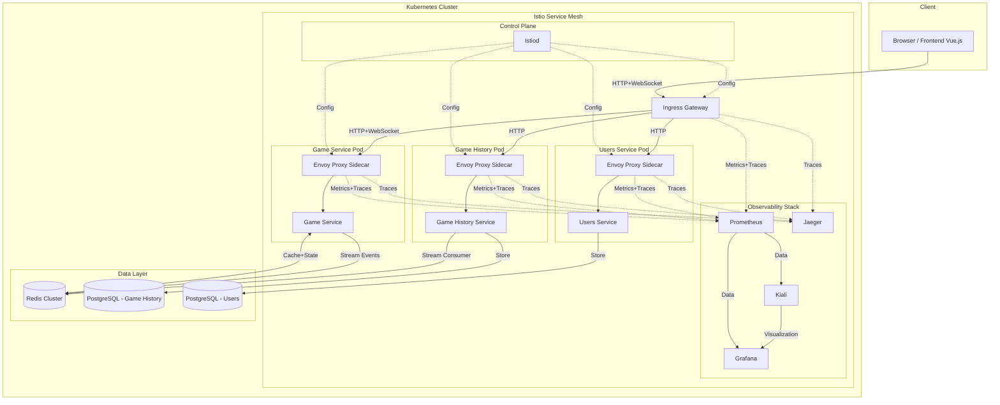

# Distributed Tictactoe
## 1. Architektur

Die verteilte Web-Applikation „Distributed Tictactoe“ ist als moderne Microservice-basierte Anwendung konzipiert, welche vollständig containerisiert in einem Kubernetes-Cluster betrieben wird. Ziel der Architektur ist eine hohe Skalierbarkeit, Ausfallsicherheit sowie die Unterstützung von Echtzeitkommunikation für ein reibungsloses Spielerlebnis.

### 1.1 Aufbau und Architekturelle Entscheidungen

Die gewählte Architektur folgt dem Microservice-Paradigma. Jede fachliche Domäne (z. B. Benutzerverwaltung, Spiellogik, Spielhistorie) ist durch einen eigenständigen Dienst repräsentiert. Diese Dienste kommunizieren über standardisierte HTTP-Schnittstellen sowie WebSockets für Echtzeitanwendungen. Die Entscheidung für Microservices basiert auf den Vorteilen in Bezug auf Skalierbarkeit, unabhängige Entwicklung und Fehlertoleranz [1].

Die Services laufen innerhalb eines Kubernetes-Clusters. Als Service Mesh kommt Istio zum Einsatz, um Aspekte wie Traffic Management, mTLS-Verschlüsselung, Observability und Policy Enforcement zentral und deklarativ zu steuern [2]. Für die lokale Entwicklung wird Minikube verwendet.

Ein Istio Ingress Gateway dient als zentraler Einstiegspunkt in das System. Über definierte `VirtualServices` wird der eingehende Datenverkehr zu den jeweiligen Services weitergeleitet.

**Funktionale Anforderungen:**

- Registrierung/Login via GitHub (OAuth2.0)
- Gast-Login
- Matchmaking (Bot/Multiplayer)
- Spielverlauf in Echtzeit
- Speicherung und Abfrage gespielter Spiele

**Nichtfunktionale Anforderungen:**

- Horizontale Skalierung
- Echtzeitfähigkeit (WebSocket)
- Fehlertoleranz (Redis Streams, mehrere Instanzen)
- Trennung von Zuständigkeiten
- Wartbarkeit & Erweiterbarkeit

### 1.2 Systemkomponenten und Interaktion

#### 1.2.1 Frontend
Das Frontend ist als Single Page Application (SPA) mit Vue.js umgesetzt. Es wird als statisches Bundle gebaut und über einen Webserver ausgeliefert, welcher im Kubernetes-Cluster über das Istio Ingress Gateway erreichbar ist. Die Applikation kommuniziert mit den Backenddiensten über REST und WebSockets.

#### 1.2.2 Users-Service
Der Users-Service implementiert die Benutzerverwaltung. Er basiert auf FastAPI und bietet Login via OAuth2.0 (GitHub), Gastzugänge sowie Authentifizierung über HTTP-only Cookies mit JWT. Die Authentifizierung wird gemäß dem OAuth2.0-Standard umgesetzt, wie von [3] beschrieben. Die Nutzerdaten werden in einer eigenen PostgreSQL-Datenbank persistiert.

Da viele andere Dienste (z. B. Game Service) den JWT validieren müssen, wird der Users-Service in mehreren Instanzen betrieben, um eine höhere Verfügbarkeit und Lastverteilung zu ermöglichen.

#### 1.2.3 Game-Service
Der Game Service implementiert die Spiellogik für das Tictactoe-Spiel. Spieler können Spielräume erstellen, beitreten und über WebSockets gegeneinander oder gegen einen Bot spielen. Die unifiziertte Schnittstelle sorgt dafür, dass Frontend die gleiche Komponenten sowohl für Bot, als auch für Multiplayer verwenden kann. Laufende Spiele werden in einem Redis-Cluster gespeichert, um schnellen Zugriff und konsistenten Spielstatus bei mehreren Instanzen zu gewährleisten.

Nach Spielende werden relevante Spieldaten als Nachrichten in Redis Streams veröffentlicht. Redis Streams ermöglichen eine Event-getriebene Kommunikation nach dem Publish-Subscribe-Prinzip, was insbesondere bei verteilten Systemen Vorteile bietet [4].

#### 1.2.4 Game History-Service
Der Game History Service konsumiert Nachrichten aus dem Redis Stream und speichert abgeschlossene Spiele in einer dedizierten PostgreSQL-Datenbank. Darüber hinaus stellt er eine REST-API bereit, über welche vergangene Spiele abgerufen werden können.

Die Entkopplung der Dienste durch den asynchronen Stream-Mechanismus erhöht die Systemrobustheit und entspricht dem Design empfohlener Event-driven Architectures [5].

#### 1.2.5 Redis Cluster
Redis übernimmt mehrere Aufgaben innerhalb des Systems:

- Speicherung des aktuellen Spielzustands
- Bereitstellung von Redis Streams für asynchrone Kommunikation zwischen Game- und History-Service
- Speicherung von Open Games

Die Wahl fiel auf Redis aufgrund seiner hohen Performance und nativen Unterstützung verteilter Datenstrukturen [6]. Dadurch, dass Redis auch eine Message Queue bereitstellt, wurde auf eine zusätzliche Messaging-Lösung verzichtet, da es eine weitere Komplexität in der Architektur mit sich gebracht hätte.

#### 1.2.6 PostgreSQL Cluster (CloudNativePG)
Für die persistente Speicherung von Benutzerdaten sowie der Spielhistorie kommen zwei voneinander getrennte PostgreSQL-Datenbanken zum Einsatz. Diese werden mithilfe von CloudNativePG als Kubernetes-native StatefulSets betrieben.

CloudNativePG bietet folgende Vorteile:

- Automatisches Failover und Replikation: Primär- und Replikasetups werden automatisiert verwaltet, was hohe Verfügbarkeit garantiert.
- Kubernetes-native Verwaltung: Ressourcen wie Cluster, Backup, ScheduledBackup und Replica werden über Kubernetes Custom Resources (CRDs) definiert.
- Einfache Integration in CI/CD: Backups, Upgrades und Rollouts lassen sich deklarativ automatisieren.
- TLS-Verschlüsselung und Benutzer-/Rollenverwaltung sind direkt integrierbar.
- Die Trennung in zwei PostgreSQL-Cluster erlaubt eine Lastverteilung und Performanceoptimierung:
- Der Users-Service interagiert mit einer für schnelle Lesezugriffe optimierten Datenbank.
- Der Game History Service nutzt ein Setup mit hohem Schreibdurchsatz, um viele Spielabschlüsse performant zu speichern.

Diese Architektur folgt dem Prinzip verteilter, fehlertoleranter Speichersysteme, wie sie auch von Tanenbaum beschrieben werden: „Distributed databases must cope with replication, partitioning and fault-tolerance[...]“ [1, Kapitel 7].

---

## 2. Umsetzung

Die technische Umsetzung orientiert sich eng an den definierten architektonischen Prinzipien. Die Anwendung wurde vollständig containerisiert und in einem Kubernetes-Cluster bereitgestellt, sowohl für lokale Entwicklung (Minikube) als auch für produktionsnahe Testszenarien. Die Wahl der eingesetzten Technologien erfolgte nach Kriterien wie Modularität, Erweiterbarkeit, Skalierbarkeit und Echtzeitfähigkeit.

### 2.1 Implementierung der Architektur

#### 2.1.1 Backend-Services mit FastAPI
Alle Backend-Microservices wurden in FastAPI umgesetzt, einem modernen Python-Webframework mit automatischer OpenAPI-Generierung und hervorragender Performance. Die Services nutzen Pydantic für Typisierung und Validierung sowie JWT für Authentifizierung. Die Servies, die eine Datenbank benötigen, verwenden SQLAlchemy für das ORM und Alembic für Migrationen. FastAPI ermöglicht eine einfache Integration von WebSockets, was für den Echtzeit-Spielbetrieb entscheidend ist. Die getrennte Entwicklung jedes Dienstes ermöglichte eine klare fachliche und technische Abgrenzung.

**Users-Service**
  - FastAPI + OAuth2.0 (GitHub)
  - JWT in HTTP-only Cookies
  - Validierung durch andere Services via `/users/me` (gibt 401 zurück, wenn Token nicht gültig)
  - Datenhaltung in PostgreSQL
  - Nutzung von SQLAlchemy für Objekt-Relational-Mapping
  - Nutzung von Alembic für Migrationen

**Game-Service**
  - FastAPI + WebSockets
  - Game-Logik, Spielstart, Spielzug
  - Zustandsdaten in Redis
  - Spielende als Event in Redis Stream

- **Game History-Service**
    - Redis Stream Consumer (Consumer Group)
    - Speicherung von Spieldaten in PostgreSQL
    - REST-API zur Abfrage
    - Nutzung von SQLAlchemy für Objekt-Relational-Mapping
    - Nutzung von Alembic für Migrationen
    - Speicherung der Spieldaten in PostgreSQL

#### 2.1.2 Websockets für Echtzeit-Spielbetrieb
Die Kommunikation beim Spiel erfolgt über WebSockets, da diese eine permanente bidirektionale Verbindung zwischen Client und Server ermöglichen. Im Gegensatz zu HTTP-Polling oder Long-Polling reduziert WebSocket die Latenz signifikant – ein entscheidender Faktor für eine flüssige Spielerfahrung [1].

#### 2.1.3 Redis für Session-Management und Event-Streaming
Redis wurde aufgrund seiner In-Memory-Natur und Unterstützung von Streams und Hashes eingesetzt. Folgende Aufgaben übernimmt Redis im System:

- Session- und Spielstatusspeicherung: Spielzustände werden als Redis Hashes gespeichert.
- Event-Streaming: Beendete Spiele werden als Event-Objekte in Redis Streams gespeichert, damit der History-Service diese asynchron verarbeiten kann.

Die Nutzung von Redis Streams erlaubt die lose Kopplung zwischen Services und unterstützt resiliente, fehlertolerante Event-getriebene Systeme [2].

#### 2.1.4 GitHub-Login mit OAuth2.0
Die Authentifizierung über GitHub erfolgt via OAuth2.0 Authorization Code Flow. Der Users-Service ruft nach erfolgreicher Authentifizierung die Nutzerdaten über die GitHub API ab und erstellt ein Session-JWT. Dieser Token wird verschlüsselt im Cookie gespeichert.

Die Entscheidung für GitHub-Login wurde getroffen, um eine einfache und für Entwickler vertraute Authentifizierungsmethode anzubieten, mit geringem Verwaltungsaufwand für Passwörter und Account-Sicherheit [3].

#### 2.1.5 Kubernetes und Istio
Alle Services wurden in Kubernetes als Deployments ausgerollt. Stateful Services wie Redis und PostgreSQL (via CloudNativePG) werden als StatefulSets betrieben. Istio wird eingesetzt für:

- mTLS-gesicherte interne Kommunikation
- Traffic Routing (z. B. Canary-Deployments)
- Retry-Strategien und Circuit Breakers
- Service-Monitoring mit Prometheus und Grafana

Das Service Mesh abstrahiert die Netzwerklogik von den Applikationen und erlaubt die Deklaration von Policies in Kubernetes-Manifests. Laut Tanenbaum ist diese Trennung zwischen Kommunikationslogik und Anwendungslogik ein Kernelement verteilter Systeme [4].

#### 2.1.6 CI mit GitHub Actions
Die Continuous Integration Pipeline wurde mit GitHub Actions implementiert. Folgende Schritte sind Teil des Workflows:
- Detektieren von Code-Änderungen
- Bauen der Container-Images
- Pushen der Images zu Docker Hub

### 2.2 Herausforderungen und Lösungen
Die Umsetzung des Projekts brachte einige Herausforderungen mit sich, die jedoch durch den Einsatz geeigneter Technologien und Architekturen gelöst werden konnten. Hier sind einige der wichtigsten Herausforderungen und deren Lösungen:
#### 2.2.1 Zustandsverwaltung bei mehreren Instanzen
**Problem**: Die Game-Services müssen bei mehreren Instanzen denselben Spielzustand kennen.

**Lösung**: Zentralisierung der Zustände in Redis – so können alle Instanzen bei jedem Spielzug synchronisiert agieren.

#### 2.2.2 Token-Validierung zwischen Services
**Problem**: Andere Services müssen Authentifizierung überprüfen, ohne User-DB-Zugriff zu haben.

**Lösung**: Der Users-Service bietet ein `/users/me`-Endpoint an. Dort wird der JWT überprüft, und falls gültig, die User-Objekt zurückgegeben. Dies ermöglicht eine zentrale Validierung des Tokens.

#### 2.2.3 Fehlertoleranz bei Event-Verarbeitung
**Problem**: Bei Ausfall des Game History-Services gehen Events verloren.

**Lösung**: Redis Streams und Consumer Groups ermöglichen eine fehlertolerante Event-Verarbeitung. Der Game History-Service kann die Events asynchron verarbeiten und bei Bedarf erneut abspielen.

#### 2.2.4 WebSocket-Routing hinter Ingress
**Problem**: WebSocket-Kommunikation funktioniert nicht durch alle Proxies korrekt.

**Lösung**: Nutzung von Istio Gateway mit expliziten WebSocket-Protokoll-Support im `VirtualService`. Zusätzlich wurden Timeouts und Header korrekt gesetzt.

---

## 3. Reflektion
Das Projekt „Distributed Tictactoe“ ermöglichte einen umfassenden praktischen Einblick in den Aufbau und Betrieb verteilter Systeme auf Basis moderner Cloud-Native-Technologien. Die iterative Entwicklung und das Testen in Kubernetes-Umgebungen sowie die Einbindung eines echten Service Meshs führten zu einem produktionsnahen Ergebnis. Dennoch zeigten sich einige technische und konzeptionelle Herausforderungen, aus denen wichtige Erkenntnisse für zukünftige Projekte abgeleitet werden konnten.

### 3.1 Was würde man anders machen?
#### 3.1.1 Service-Kommunikation stärker entkoppeln
Die Authentifizierungsvalidierung durch direkte Anfragen anderer Services an den Users-Service führte zu einer gewissen Kopplung. In zukünftigen Projekten wäre der Einsatz eines JWT Public Key Signing Mechanismus (z. B. JWKs + RS256) sinnvoller. Damit könnten alle Services Tokens selbstständig validieren, ohne den Users-Service aufrufen zu müssen. Dies würde Latenz, Fehlertoleranz und Skalierbarkeit verbessern.

#### 3.1.2 Monitoring und Logging früher integrieren
Ein vollständiges Observability-Setup (Logging, Tracing, Metriken) wurde erst spät im Projekt ergänzt. Eine frühzeitige Integration hätte die Fehlersuche, insbesondere bei WebSocket-Problemen, deutlich erleichtert. Tools wie OpenTelemetry oder Grafana Tempo könnten künftig bereits im MVP-Stadium eingebunden werden.

#### 3.1.3 Frontend-Kommunikation abstrahieren
Die enge Kopplung des Frontends an konkrete API-Endpunkte erschwerte Anpassungen der Schnittstellen. Künftig sollte ein API-Client Layer mit klaren Interfaces integriert werden, um die Testbarkeit und Austauschbarkeit von Schnittstellen zu erhöhen.

#### 3.1.4Deployment-Vereinfachung mit GitOps
Das manuelle Anstoßen von Deployments über CI/CD war zwar funktional, aber nicht optimal wartbar. Die Einführung von GitOps mit Tools wie ArgoCD oder Flux würde konsistenteres und auditierbares Deployment ermöglichen – ein wichtiger Aspekt in produktionsnahen Szenarien.

### 3.2 Größte Herausforderungen

| Herausforderung        | Lösung                           |
| ---------------------- | -------------------------------- |
| Verteilte Zustandsverwaltung (mehrere Game-Service-Instanzen) | Konsistenter, zentraler Speicher in Redis inkl. Locking-Mechanismen.|
| Fehlertoleranz bei asynchroner Kommunikation   | Redis Streams + Consumer Groups für persistente Event-Verarbeitung.  |
| WebSocket-Kompatibilität hinter Ingress/Istio      | Spezielle Konfigurationen im Istio Gateway mit WebSocket-Support. |
| Testbarkeit von OAuth2.0-Login-Flows | Einsatz von Gast-Usern im lokalen Minikube mit Umgehung echter GitHub-Auth für lokale Entwicklung. |

Diese Herausforderungen spiegeln klassische Probleme verteilter Systeme wider: Synchronisation, Zustandsverwaltung, Kommunikation, Ausfallsicherheit und Sicherheit. Das Projekt zeigte in der Praxis, wie sich durch Cloud-Native-Prinzipien – wie Zustandslosigkeit, zentrale Kommunikation, Containerisierung und Service Meshes – diese Aspekte lösungsorientiert adressieren lassen, ganz im Sinne der Prinzipien moderner verteilter Architekturen [1].

### Fazit
Die Implementierung von Distributed Tictactoe bot einen ganzheitlichen Einblick in die Entwicklung, den Betrieb und die Wartung einer modernen, verteilten Webapplikation. Die Anwendung demonstriert, wie sich klassische Konzepte aus der Theorie verteilter Systeme – wie sie z. B. bei Tanenbaum beschrieben werden – mit aktuellen Technologien wie Kubernetes, FastAPI, Redis und Istio praktisch umsetzen lassen. Auch wenn Verbesserungspotenziale bestehen, konnte ein funktionales, fehlertolerantes und modular skalierbares System aufgebaut werden, das sich für weitere Erweiterungen – z. B. Matchmaking, Ranglisten oder KI-Gegner – eignet.

---

## Literaturverzeichnis

[1] A. S. Tanenbaum and M. van Steen, _Distributed Systems: Principles and Paradigms_, 2nd ed. Upper Saddle River, NJ, USA: Pearson, 2007.

[2]  Istio Authors, “Istio Documentation,” [Online]. Available: https://istio.io/latest/docs/. [Accessed: 06-Apr-2025].

[3] IETF, “The OAuth 2.0 Authorization Framework,” RFC 6749, Oct. 2012. [Online]. Available: https://tools.ietf.org/html/rfc6749  

[4] Redis Authors, “Redis Streams,” [Online]. Available: https://redis.io/docs/data-types/streams/. [Accessed: 06-Apr-2025].

[5] M. Fowler, “Event-Driven Architecture,” [Online]. Available: https://martinfowler.com/articles/201701-event-driven.html. [Accessed: 06-Apr-2025].

[6] Redis Authors, “Redis – In-Memory Data Structure Store,” [Online]. Available: https://redis.io/. [Accessed: 06-Apr-2025].
